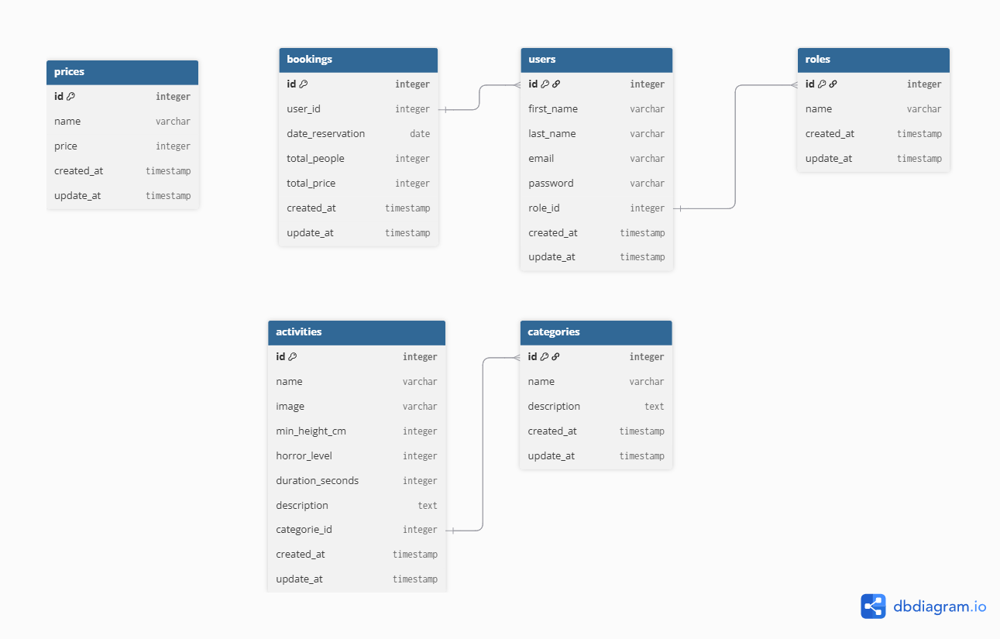

# MLD

```js

Table users {
  id integer [primary key]
  first_name varchar
  last_name varchar
  email varchar
  password varchar
  age integer
  role_id integer
  created_at timestamp
  update_at timestamp
}

Table attractions {
  id integer [primary key]
  name varchar
  image varchar
  min_height integer
  horror_level integer
  duration integer
  description text
  categorie_id integer
  created_at timestamp
  update_at timestamp
}


Table roles {
  id integer [primary key]
  name varchar
  created_at timestamp
  update_at timestamp
}

Table categories {
  id integer [primary key]
  name varchar
  description text
  created_at timestamp
  update_at timestamp
}


Table bookings {
  id integer [primary key]
  user_id integer
  date_reservation date
  total_people integer
  total_price integer
  created_at timestamp
  update_at timestamp
}

table prices {
  id integer [primary key]
  name varchar
  price integer
  created_at timestamp
  update_at timestamp
}

Ref: "users"."role_id" < "roles"."id"

Ref: "bookings"."user_id" < "users"."id"

Ref: "attractions"."categorie_id" < "categories"."id"

```

