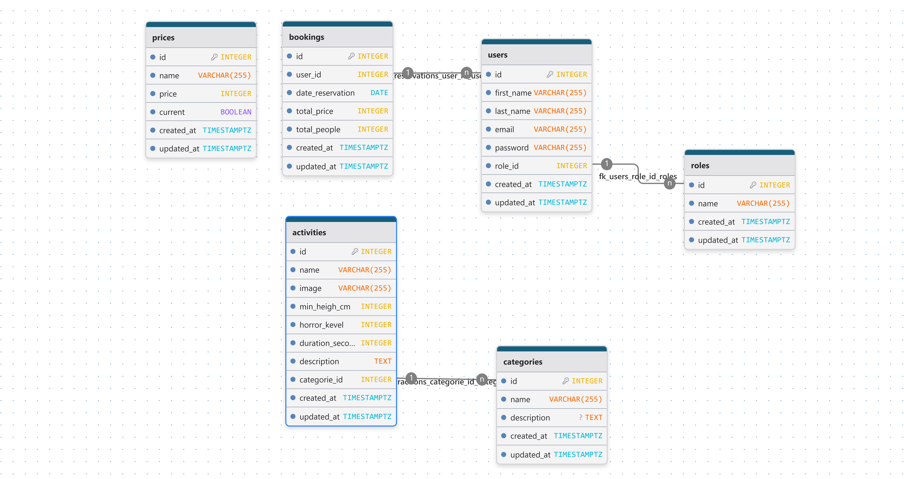

# MPD

```sql

CREATE TABLE IF NOT EXISTS "users" (
	"id" INTEGER NOT NULL UNIQUE GENERATED BY DEFAULT AS IDENTITY,
	"first_name" VARCHAR(255) NOT NULL,
	"last_name" VARCHAR(255) NOT NULL,
	"email" VARCHAR(255) NOT NULL UNIQUE,
	"password" VARCHAR(255) NOT NULL,
	"role_id" INTEGER NOT NULL,
	"created_at" TIMESTAMPTZ NOT NULL,
	"updated_at" TIMESTAMPTZ NOT NULL,
	PRIMARY KEY("id")
);


CREATE TABLE IF NOT EXISTS "roles" (
	"id" INTEGER NOT NULL UNIQUE GENERATED BY DEFAULT AS IDENTITY,
	"name" VARCHAR(255) NOT NULL,
	"created_at" TIMESTAMPTZ NOT NULL,
	"updated_at" TIMESTAMPTZ NOT NULL,
	PRIMARY KEY("id")
);


CREATE TABLE IF NOT EXISTS "prices" (
	"id" INTEGER NOT NULL UNIQUE GENERATED BY DEFAULT AS IDENTITY,
	"name" VARCHAR(255) NOT NULL,
	"price" INTEGER NOT NULL,
	"current" BOOLEAN NOT NULL,
	"created_at" TIMESTAMPTZ NOT NULL,
	"updated_at" TIMESTAMPTZ NOT NULL,
	PRIMARY KEY("id")
);


CREATE TABLE IF NOT EXISTS "activities" (
	"id" INTEGER NOT NULL UNIQUE GENERATED BY DEFAULT AS IDENTITY,
	"name" VARCHAR(255) NOT NULL,
	"image" VARCHAR(255) NOT NULL,
	"min_heigh_cm" INTEGER NOT NULL UNIQUE,
	"horror_kevel" INTEGER NOT NULL,
	"duration_seconds" INTEGER NOT NULL,
	"description" TEXT NOT NULL,
	"categorie_id" INTEGER NOT NULL,
	"created_at" TIMESTAMPTZ NOT NULL,
	"updated_at" TIMESTAMPTZ NOT NULL,
	PRIMARY KEY("id")
);


CREATE TABLE IF NOT EXISTS "categories" (
	"id" INTEGER NOT NULL UNIQUE GENERATED BY DEFAULT AS IDENTITY,
	"name" VARCHAR(255) NOT NULL,
	"description" TEXT,
	"created_at" TIMESTAMPTZ NOT NULL,
	"updated_at" TIMESTAMPTZ NOT NULL,
	PRIMARY KEY("id")
);


CREATE TABLE IF NOT EXISTS "bookings" (
	"id" INTEGER NOT NULL UNIQUE GENERATED BY DEFAULT AS IDENTITY,
	"user_id" INTEGER NOT NULL,
	"date_reservation" DATE NOT NULL,
	"total_price" INTEGER NOT NULL,
	"total_people" INTEGER NOT NULL,
	"created_at" TIMESTAMPTZ NOT NULL,
	"updated_at" TIMESTAMPTZ NOT NULL,
	PRIMARY KEY("id")
);


ALTER TABLE "users"
ADD FOREIGN KEY("role_id") REFERENCES "roles"("id")
ON UPDATE NO ACTION ON DELETE CASCADE;
ALTER TABLE "activities"
ADD FOREIGN KEY("categorie_id") REFERENCES "categories"("id")
ON UPDATE NO ACTION ON DELETE CASCADE;
ALTER TABLE "bookings"
ADD FOREIGN KEY("user_id") REFERENCES "users"("id")
ON UPDATE NO ACTION ON DELETE CASCADE;

```

